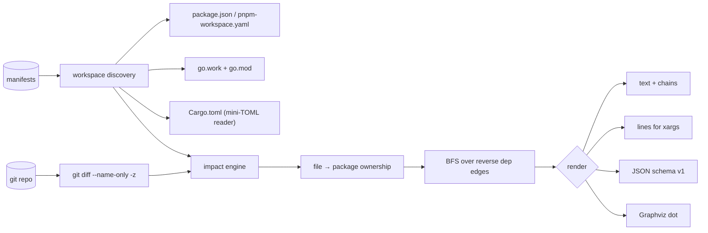

# blastmap

[English](README.md) | [中文](README.zh.md) | [日本語](README.ja.md)

[](LICENSE) [](go.mod) [](CHANGELOG.md)  [](CONTRIBUTING.md)

**blastmap：git 範囲がどのワークスペースパッケージに影響するかを計算し、CI のターゲットを出力するオープンソース・ゼロ依存 CLI —— 既存のマニフェストだけで nx/turbo 流の "affected" ロジックを実現、ビルドシステムの導入は不要。**


```bash
git clone https://github.com/JaydenCJ/blastmap && cd blastmap
go build -o blastmap ./cmd/blastmap    # single static binary, stdlib only
```

> プレリリース：v0.1.0 はまだどのレジストリにも公開されていません。上記の手順でソースからビルドしてください（Go ≥1.22）。

## なぜ blastmap？

モノレポの CI 費用が痛いのは、diff が末端の 1 パッケージしか触れていなくても push のたびに全部をテストするからです。定番の解決策 —— nx や Turborepo の `affected` —— は確かに機能しますが、ビルドシステム丸ごとの導入が前提：各パッケージに専用設定ファイル、スクリプトを包むタスクランナー、デーモンにキャッシュ。Bazel はさらに先を行きます。欲しいのが*あの問いの答え*だけ —— 「`origin/main...HEAD` を与えたら、CI はどのパッケージを再ビルドすべきか？」 —— なら、その導入コストは馬鹿げていて、しかも答えはリポジトリに既にあるファイルの中に眠っています：`package.json` の workspaces、`pnpm-workspace.yaml`、`go.work` + `go.mod`、Cargo の `[workspace]` テーブル。blastmap はまさにそれだけを読み、git diff をパッケージディレクトリに写像し、内部依存グラフに沿って伝播させ（dev エッジは分離可能、lockfile はグローバル扱い）、爆発半径をテキスト・`xargs` 向けの `lines`・バージョン付き JSON で出力します —— 挙げられた各パッケージには why チェーン付き。静的バイナリ 1 個、ビルドコマンドはあなたのまま。

| | blastmap | nx affected | turbo --filter | git diff + grep |
|---|---|---|---|---|
| ビルドシステム導入なしで動く | ✅ | ❌ タスクを掌握 | ❌ パイプラインを掌握 | ✅ |
| 既存マニフェストのみ読む | ✅ | ❌ nx.json + project.json | ❌ turbo.json | n/a |
| 依存グラフ伝播 | ✅ | ✅ | ✅ | ❌ パスのみ |
| npm/pnpm/yarn + Go + Cargo を 1 ツールで | ✅ | JS 優先（プラグイン） | JS/TS のみ | n/a |
| 影響パッケージごとの証拠チェーン | ✅ | ❌ | ❌ | ❌ |
| lockfile / 無所属ファイルの安全規則 | ✅ | 部分的 | 部分的 | ❌ |
| ランタイム依存 | 0 | 数百（npm） | Rust バイナリ + npm シム | 0 |

<sub>依存数は 2026-07-12 に確認：blastmap は Go 標準ライブラリのみを import。nx CLI はリポジトリに 100+ の推移的 npm パッケージを引き込みます。</sub>

## 特徴

- **マニフェストネイティブな発見** —— `package.json` workspaces（配列・オブジェクト両形式）、`pnpm-workspace.yaml`（`!否定` 含む）、`go.work` + `go.mod`（`require` と相対 `replace`）、Cargo `[workspace]` テーブル（path 依存、`workspace = true`、リネーム、target 別テーブル）を読む。混在エコシステムのリポジトリも並行ロード。
- **証拠付きの爆発半径伝播** —— 変更パッケージは最深ディレクトリ所有で判定、依存元は逆向きエッジの BFS で辿り、すべての判定にチェーンが付く：`@demo/web -> @demo/ui -> @demo/utils`。
- **CI 向けに設計された出力** —— 人間向けテキスト、ソート済みで `xargs -r` に直結する `lines`、安定 JSON（`schema_version: 1`、パッケージごとに `status`・`files`・`via`）。
- **グローバルファイル規則** —— ルートの lockfile とワークスペースマニフェストは既定で全体に影響。`--global 'ci/**'` で追加、`--no-default-globals` で無効化。
- **無所属ファイルポリシー** —— どのパッケージにも属さないファイルは報告され、`--unclaimed affect-all|error` で「全部再実行」規則や CI ゲート（exit 1）に変えられる。
- **グラフツール同梱** —— `blastmap graph --format dot` は内部依存グラフを Graphviz 用に描画。`list` はエコシステム別にメンバーを棚卸し。
- **ゼロ依存・完全オフライン** —— Go 標準ライブラリのみ。対話する相手はローカルの `git` だけ（`--stdin-files` なら git すら不要）。テレメトリなし、ネットワーク通信は一切なし。

## クイックスタート

```bash
# build the demo monorepo (web -> ui -> utils, api -> utils, + a stray root file)
bash examples/make-demo-repo.sh /tmp/blastmap-demo
./blastmap affected /tmp/blastmap-demo
```

実際にキャプチャした出力：

```text
blastmap affected — HEAD~1..HEAD, 2 files changed
workspace: npm (5 packages)

changed
  @demo/utils  packages/utils  1 file

dependent
  @demo/api    apps/api        via @demo/api -> @demo/utils
  @demo/ui     packages/ui     via @demo/ui -> @demo/utils
  @demo/web    apps/web        via @demo/web -> @demo/ui -> @demo/utils

unclaimed (1 file owned by no package)
  NOTES.md

4 of 5 packages affected
```

CI に流す（`--format lines` はソート済みかつ空集合セーフ、実出力）：

```text
$ ./blastmap affected --format lines /tmp/blastmap-demo
@demo/api
@demo/ui
@demo/utils
@demo/web
```

典型的なパイプライン：`blastmap affected --range origin/main...HEAD --format lines | xargs -r -n1 npm test -w` —— `A...B` 形式は merge-base から diff し、PR ビルドにぴったり。空なら丸ごとスキップする JSON 版は [examples/ci-gate.sh](examples/ci-gate.sh) を参照。

## CLI リファレンス

`blastmap [affected|list|graph|version] [flags] [path]` —— 既定サブコマンドは `affected`。終了コード：0 正常、1 ゲート失敗（`--unclaimed error`）、2 用法エラー、3 実行時エラー。

| フラグ | 既定値 | 効果 |
|---|---|---|
| `--range` | `HEAD~1..HEAD` | diff する git 範囲。`A...B` は merge-base から比較 |
| `--uncommitted` | オフ | 作業ツリー・ステージ済み・未追跡の変更も含める |
| `--stdin-files` | オフ | git の代わりに stdin から変更パスを読む（改行/NUL 区切り） |
| `--format` | `text` | `text`・`lines`・`json`（`graph` は `text`/`json`/`dot`） |
| `--paths` | オフ | `--format lines` と併用でパッケージ名の代わりにディレクトリを出力 |
| `--direct-only` | オフ | 直接変更されたパッケージのみ。逆依存は辿らない |
| `--with-deps` | オフ | 影響集合の依存も列挙（ステータス `dependency`） |
| `--no-dev` | オフ | dev 依存エッジを無視（npm `devDependencies`、Cargo dev-deps） |
| `--ecosystem` | `auto` | `npm`・`go`・`cargo` に限定 |
| `--global` | — | 変更が全パッケージに波及する glob を追加（繰り返し可） |
| `--no-default-globals` | オフ | 組み込みの lockfile/マニフェストのグローバル一覧を無効化 |
| `--unclaimed` | `ignore` | 無所属ファイルの扱い：`ignore`・`affect-all`・`error` |

各エコシステムで何がメンバー・内部エッジ・グローバルファイルになるかの厳密な仕様は [docs/manifests.md](docs/manifests.md) にあります。

## 検証

このリポジトリは CI を同梱しません。上記の主張はすべてローカル実行で検証されます：

```bash
go test ./...            # 89 deterministic tests, offline, < 5 s
bash scripts/smoke.sh    # end-to-end CLI check, prints SMOKE OK
```

## アーキテクチャ



## ロードマップ

- [x] v0.1.0 —— npm/pnpm/yarn + go.work + Cargo の発見、証拠チェーン付き爆発半径伝播、グローバル/無所属ファイル規則、text/lines/JSON/dot 出力、89 テスト + smoke スクリプト
- [ ] `go list` による単一モジュール Go リポジトリのパッケージ単位グラフ（オプトイン、ツールチェーン必須）
- [ ] リリーストレイン向けの `--since-tag` と `--changed-only-json` 便利モード
- [ ] Bun と Deno のワークスペースマニフェスト
- [ ] ターゲットテンプレート（`--exec 'npm test -w {name}'`）と並列数上限
- [ ] watch モード：作業ツリーの変化に合わせて爆発半径を再計算

全リストは [open issues](https://github.com/JaydenCJ/blastmap/issues) を参照。

## コントリビュート

Issue・議論・PR を歓迎します —— ローカルの作業フロー（フォーマット、vet、テスト、`SMOKE OK`）は [CONTRIBUTING.md](CONTRIBUTING.md) を参照。入門タスクは [good first issue](https://github.com/JaydenCJ/blastmap/issues?q=is%3Aissue+is%3Aopen+label%3A%22good+first+issue%22) ラベル、設計の相談は [Discussions](https://github.com/JaydenCJ/blastmap/discussions) へ。

## ライセンス

[MIT](LICENSE)
