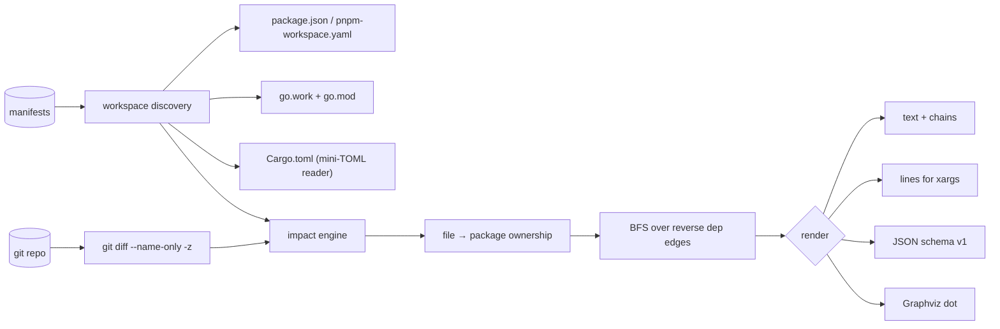

# blastmap

[English](README.md) | [中文](README.zh.md) | [日本語](README.ja.md)

[](LICENSE) [](go.mod) [](CHANGELOG.md)  [](CONTRIBUTING.md)

**blastmap：an open-source, zero-dependency CLI that computes which workspace packages a git range affects and prints the targets for CI — nx/turbo-style "affected" logic from the manifests you already have, no build-system adoption required.**


```bash
git clone https://github.com/JaydenCJ/blastmap && cd blastmap
go build -o blastmap ./cmd/blastmap    # single static binary, stdlib only
```

> Pre-release: v0.1.0 is not tagged on a package registry yet; build from source as above (any Go ≥1.22).

## Why blastmap?

Monorepo CI bills hurt because every push tests everything, even when the diff touches one leaf package. The established fix — nx or Turborepo's `affected` — works, but only after you adopt the whole build system: their config files in every package, their task runner wrapping your scripts, their daemon, their cache. Bazel goes further still. If all you want is the *question answered* — "given `origin/main...HEAD`, which packages must CI rebuild?" — that adoption cost is absurd, and the answer already lives in files your repo has today: `package.json` workspaces, `pnpm-workspace.yaml`, `go.work` + `go.mod`, Cargo `[workspace]` tables. blastmap reads exactly those, maps the git diff onto package directories, propagates through the internal dependency graph (dev-edges separable, lockfiles treated as global), and prints the blast radius as text, `lines` for `xargs`, or versioned JSON — with a why-chain for every package it names. One static binary; your build commands stay yours.

| | blastmap | nx affected | turbo --filter | git diff + grep |
|---|---|---|---|---|
| Works without adopting a build system | ✅ | ❌ owns your tasks | ❌ owns your pipeline | ✅ |
| Reads existing manifests only | ✅ | ❌ nx.json + project.json | ❌ turbo.json | n/a |
| Dependency-graph propagation | ✅ | ✅ | ✅ | ❌ paths only |
| npm/pnpm/yarn + Go + Cargo in one tool | ✅ | JS-first (plugins) | JS/TS only | n/a |
| Evidence chain per affected package | ✅ | ❌ | ❌ | ❌ |
| Lockfile/unclaimed-file safety rules | ✅ | partial | partial | ❌ |
| Runtime dependencies | 0 | hundreds (npm) | Rust binary + npm shim | 0 |

<sub>Dependency counts checked 2026-07-12: blastmap imports the Go standard library only; the nx CLI pulls 100+ transitive npm packages into your repo.</sub>

## Features

- **Manifest-native discovery** — reads `package.json` workspaces (array and object form), `pnpm-workspace.yaml` (incl. `!negations`), `go.work` + `go.mod` (`require` and relative `replace`), and Cargo `[workspace]` tables (path deps, `workspace = true`, renames, target-specific tables). Mixed-ecosystem repos load side by side.
- **Blast-radius propagation with receipts** — changed packages are found by deepest-directory ownership, dependents by BFS over reverse edges, and every verdict carries a chain: `@demo/web -> @demo/ui -> @demo/utils`.
- **CI-shaped outputs** — human text, sorted `lines` for `xargs -r`, and stable JSON (`schema_version: 1`) with per-package `status`, `files`, and `via`.
- **Global-file rules** — root lockfiles and workspace manifests affect everything by default; add your own with `--global 'ci/**'`, or opt out via `--no-default-globals`.
- **Unclaimed-file policy** — files no package owns are reported, and `--unclaimed affect-all|error` turns them into a rerun-everything rule or a CI gate (exit 1).
- **Graph tooling included** — `blastmap graph --format dot` renders the internal dependency graph for Graphviz; `list` inventories members per ecosystem.
- **Zero dependencies, fully offline** — Go standard library only; the only thing it ever talks to is your local `git` (and not even that with `--stdin-files`). No telemetry, no network, ever.

## Quickstart

```bash
# build the demo monorepo (web -> ui -> utils, api -> utils, + a stray root file)
bash examples/make-demo-repo.sh /tmp/blastmap-demo
./blastmap affected /tmp/blastmap-demo
```

Real captured output:

```text
blastmap affected — HEAD~1..HEAD, 2 files changed
workspace: npm (5 packages)

changed
  @demo/utils  packages/utils  1 file

dependent
  @demo/api    apps/api        via @demo/api -> @demo/utils
  @demo/ui     packages/ui     via @demo/ui -> @demo/utils
  @demo/web    apps/web        via @demo/web -> @demo/ui -> @demo/utils

unclaimed (1 file owned by no package)
  NOTES.md

4 of 5 packages affected
```

Feed CI (`--format lines` is sorted and empty-safe, real output):

```text
$ ./blastmap affected --format lines /tmp/blastmap-demo
@demo/api
@demo/ui
@demo/utils
@demo/web
```

Typical pipeline: `blastmap affected --range origin/main...HEAD --format lines | xargs -r -n1 npm test -w` — the `A...B` form diffs from the merge-base, exactly what a PR build wants. See [examples/ci-gate.sh](examples/ci-gate.sh) for a skip-when-empty JSON variant.

## CLI reference

`blastmap [affected|list|graph|version] [flags] [path]` — `affected` is the default. Exit codes: 0 ok, 1 gate failure (`--unclaimed error`), 2 usage error, 3 runtime error.

| Flag | Default | Effect |
|---|---|---|
| `--range` | `HEAD~1..HEAD` | git range to diff; `A...B` compares from the merge-base |
| `--uncommitted` | off | also include working-tree, staged, and untracked changes |
| `--stdin-files` | off | read changed paths from stdin instead of git (newline/NUL separated) |
| `--format` | `text` | `text`, `lines`, or `json` (`graph`: `text`/`json`/`dot`) |
| `--paths` | off | with `--format lines`, print package directories instead of names |
| `--direct-only` | off | only directly changed packages; skip reverse dependencies |
| `--with-deps` | off | also list dependencies of the affected set (status `dependency`) |
| `--no-dev` | off | ignore dev-dependency edges (npm `devDependencies`, Cargo dev-deps) |
| `--ecosystem` | `auto` | restrict to `npm`, `go`, or `cargo` |
| `--global` | — | extra glob whose change affects every package (repeatable) |
| `--no-default-globals` | off | disable the built-in lockfile/manifest global list |
| `--unclaimed` | `ignore` | `ignore`, `affect-all`, or `error` for files no package owns |

What counts as a member, an internal edge, or a global file per ecosystem is specified precisely in [docs/manifests.md](docs/manifests.md).

## Verification

This repository ships no CI; every claim above is verified by local runs:

```bash
go test ./...            # 89 deterministic tests, offline, < 5 s
bash scripts/smoke.sh    # end-to-end CLI check, prints SMOKE OK
```

## Architecture



## Roadmap

- [x] v0.1.0 — npm/pnpm/yarn + go.work + Cargo discovery, blast-radius propagation with evidence chains, global/unclaimed file rules, text/lines/JSON/dot outputs, 89 tests + smoke script
- [ ] Single-module Go repos via `go list` package graphs (opt-in, needs the toolchain)
- [ ] `--since-tag` and `--changed-only-json` convenience modes for release trains
- [ ] Bun and Deno workspace manifests
- [ ] Target templates (`--exec 'npm test -w {name}'`) with bounded parallelism
- [ ] Watch mode: recompute the blast radius as the working tree changes

See the [open issues](https://github.com/JaydenCJ/blastmap/issues) for the full list.

## Contributing

Issues, discussions and pull requests are welcome — see [CONTRIBUTING.md](CONTRIBUTING.md) for the local workflow (format, vet, tests, `SMOKE OK`). Good entry points are labelled [good first issue](https://github.com/JaydenCJ/blastmap/issues?q=is%3Aissue+is%3Aopen+label%3A%22good+first+issue%22), and design questions live in [Discussions](https://github.com/JaydenCJ/blastmap/discussions).

## License

[MIT](LICENSE)
