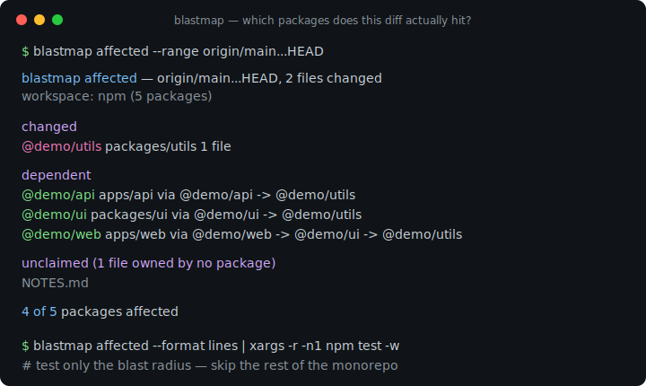
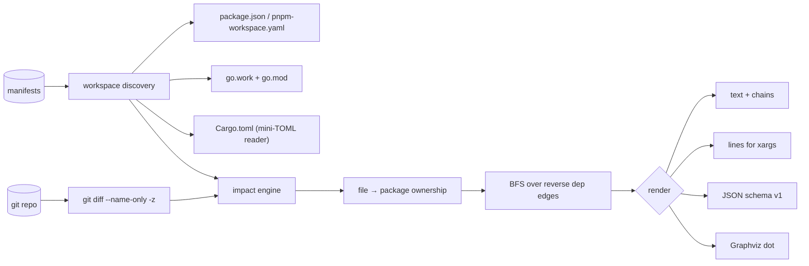

# blastmap

[English](README.md) | [中文](README.zh.md) | [日本語](README.ja.md)

[](LICENSE) [](go.mod) [](CHANGELOG.md)  [](CONTRIBUTING.md)

**blastmap：开源、零依赖的 CLI，计算一段 git 范围影响了哪些 workspace 包并输出 CI 目标 —— 用你已有的 manifest 实现 nx/turbo 式的 "affected" 逻辑，无需引入整套构建系统。**



```bash
git clone https://github.com/JaydenCJ/blastmap && cd blastmap
go build -o blastmap ./cmd/blastmap    # single static binary, stdlib only
```

> 预发布说明：v0.1.0 尚未发布到任何包仓库；请按上述方式从源码构建（Go ≥1.22 即可）。

## 为什么选 blastmap？

Monorepo 的 CI 账单之所以疼，是因为每次 push 都测试所有东西，哪怕 diff 只碰了一个叶子包。业界的标准答案 —— nx 或 Turborepo 的 `affected` —— 确实有效，但前提是整套构建系统全盘接入：每个包里放它们的配置文件、用它们的任务运行器包住你的脚本、还有守护进程和缓存。Bazel 走得更远。如果你只想要*那个问题的答案* —— "给定 `origin/main...HEAD`，CI 必须重建哪些包？" —— 这种接入成本荒谬至极，而答案本来就躺在你仓库已有的文件里：`package.json` workspaces、`pnpm-workspace.yaml`、`go.work` + `go.mod`、Cargo 的 `[workspace]` 表。blastmap 恰好只读这些文件，把 git diff 映射到包目录，沿内部依赖图传播（dev 边可单独剥离，lockfile 视为全局），再把爆炸半径输出为文本、供 `xargs` 用的 `lines`、或带版本号的 JSON —— 每个被点名的包都附带 why 链。一个静态二进制；构建命令仍然是你自己的。

| | blastmap | nx affected | turbo --filter | git diff + grep |
|---|---|---|---|---|
| 无需接入构建系统即可使用 | ✅ | ❌ 接管你的任务 | ❌ 接管你的流水线 | ✅ |
| 只读已有 manifest | ✅ | ❌ nx.json + project.json | ❌ turbo.json | n/a |
| 依赖图传播 | ✅ | ✅ | ✅ | ❌ 只有路径 |
| npm/pnpm/yarn + Go + Cargo 一个工具全覆盖 | ✅ | JS 优先（插件制） | 仅 JS/TS | n/a |
| 每个受影响包附证据链 | ✅ | ❌ | ❌ | ❌ |
| lockfile / 无主文件安全规则 | ✅ | 部分 | 部分 | ❌ |
| 运行时依赖 | 0 | 数百个（npm） | Rust 二进制 + npm 垫片 | 0 |

<sub>依赖数量核查于 2026-07-12：blastmap 仅导入 Go 标准库；nx CLI 会往你的仓库拉进 100+ 个传递 npm 包。</sub>

## 特性

- **manifest 原生发现** —— 读取 `package.json` workspaces（数组与对象两种形式）、`pnpm-workspace.yaml`（含 `!否定`）、`go.work` + `go.mod`（`require` 与相对路径 `replace`）、以及 Cargo `[workspace]` 表（path 依赖、`workspace = true`、重命名、target 专属表）。混合生态仓库可并行加载。
- **带凭据的爆炸半径传播** —— 变更包按最深目录归属判定，依赖方沿反向边做 BFS，每个结论都带一条链：`@demo/web -> @demo/ui -> @demo/utils`。
- **为 CI 而生的输出** —— 人类可读文本、排好序可直接 `xargs -r` 的 `lines`、以及稳定 JSON（`schema_version: 1`），含每包 `status`、`files`、`via`。
- **全局文件规则** —— 根 lockfile 与 workspace manifest 默认影响一切；用 `--global 'ci/**'` 追加你自己的，或用 `--no-default-globals` 退出。
- **无主文件策略** —— 没有任何包认领的文件会被上报，`--unclaimed affect-all|error` 可把它变成"全部重跑"规则或 CI 门禁（exit 1）。
- **附带图工具** —— `blastmap graph --format dot` 输出内部依赖图供 Graphviz 渲染；`list` 按生态盘点成员。
- **零依赖、完全离线** —— 仅 Go 标准库；它唯一对话的对象是你本地的 `git`（用 `--stdin-files` 时连 git 都不需要）。无遥测，永不联网。

## 快速上手

```bash
# build the demo monorepo (web -> ui -> utils, api -> utils, + a stray root file)
bash examples/make-demo-repo.sh /tmp/blastmap-demo
./blastmap affected /tmp/blastmap-demo
```

真实捕获的输出：

```text
blastmap affected — HEAD~1..HEAD, 2 files changed
workspace: npm (5 packages)

changed
  @demo/utils  packages/utils  1 file

dependent
  @demo/api    apps/api        via @demo/api -> @demo/utils
  @demo/ui     packages/ui     via @demo/ui -> @demo/utils
  @demo/web    apps/web        via @demo/web -> @demo/ui -> @demo/utils

unclaimed (1 file owned by no package)
  NOTES.md

4 of 5 packages affected
```

喂给 CI（`--format lines` 已排序且空集安全，真实输出）：

```text
$ ./blastmap affected --format lines /tmp/blastmap-demo
@demo/api
@demo/ui
@demo/utils
@demo/web
```

典型流水线：`blastmap affected --range origin/main...HEAD --format lines | xargs -r -n1 npm test -w` —— `A...B` 形式从 merge-base 开始 diff，正是 PR 构建想要的。空集即跳过的 JSON 变体见 [examples/ci-gate.sh](examples/ci-gate.sh)。

## CLI 参考

`blastmap [affected|list|graph|version] [flags] [path]` —— 默认子命令是 `affected`。退出码：0 正常，1 门禁失败（`--unclaimed error`），2 用法错误，3 运行时错误。

| 参数 | 默认值 | 效果 |
|---|---|---|
| `--range` | `HEAD~1..HEAD` | 要 diff 的 git 范围；`A...B` 从 merge-base 开始比较 |
| `--uncommitted` | 关 | 同时纳入工作区、暂存区与未跟踪的变更 |
| `--stdin-files` | 关 | 从 stdin 读取变更路径而不走 git（换行/NUL 分隔） |
| `--format` | `text` | `text`、`lines` 或 `json`（`graph`：`text`/`json`/`dot`） |
| `--paths` | 关 | 配合 `--format lines` 输出包目录而非包名 |
| `--direct-only` | 关 | 只列直接变更的包；不追反向依赖 |
| `--with-deps` | 关 | 同时列出受影响集合的依赖（状态为 `dependency`） |
| `--no-dev` | 关 | 忽略 dev 依赖边（npm `devDependencies`、Cargo dev-deps） |
| `--ecosystem` | `auto` | 限定为 `npm`、`go` 或 `cargo` |
| `--global` | — | 追加"变更即影响所有包"的 glob（可重复） |
| `--no-default-globals` | 关 | 禁用内置的 lockfile/manifest 全局清单 |
| `--unclaimed` | `ignore` | 无主文件的处理：`ignore`、`affect-all` 或 `error` |

每个生态里什么算成员、什么算内部边、什么算全局文件，精确定义见 [docs/manifests.md](docs/manifests.md)。

## 验证

本仓库不带 CI；以上所有断言均由本地运行验证：

```bash
go test ./...            # 89 deterministic tests, offline, < 5 s
bash scripts/smoke.sh    # end-to-end CLI check, prints SMOKE OK
```

## 架构



## 路线图

- [x] v0.1.0 —— npm/pnpm/yarn + go.work + Cargo 发现、带证据链的爆炸半径传播、全局/无主文件规则、text/lines/JSON/dot 输出、89 个测试 + smoke 脚本
- [ ] 通过 `go list` 支持单 module 的 Go 仓库包级图（可选启用，需要工具链）
- [ ] 面向发布列车的 `--since-tag` 与 `--changed-only-json` 便捷模式
- [ ] Bun 与 Deno 的 workspace manifest
- [ ] 目标模板（`--exec 'npm test -w {name}'`）并带并发上限
- [ ] watch 模式：工作区一变就重算爆炸半径

完整列表见 [open issues](https://github.com/JaydenCJ/blastmap/issues)。

## 参与贡献

欢迎 issue、讨论与 PR —— 本地工作流（格式化、vet、测试、`SMOKE OK`）见 [CONTRIBUTING.md](CONTRIBUTING.md)。入门任务标记为 [good first issue](https://github.com/JaydenCJ/blastmap/issues?q=is%3Aissue+is%3Aopen+label%3A%22good+first+issue%22)，设计问题请到 [Discussions](https://github.com/JaydenCJ/blastmap/discussions)。

## 许可证

[MIT](LICENSE)
